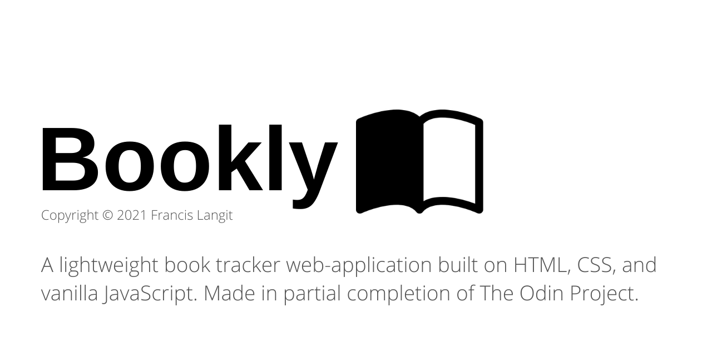

`bookly` is a book tracking web-application built on HTML5, CSS, and vanilla JavaScript. It was created in partial completion of [The Odin Project's Full Stack JavaScript path curriculum](https://www.theodinproject.com/paths/full-stack-javascript/courses/javascript/lessons/library).

## Installation

[A live deployment of `bookly` is available on GitHub pages.](https://francislangit.github.io/bookly/)

For those that would like to run the application and/or edit its source code on their local computer, follow the steps below:

1. Clone the repository with `git clone https://github.com/FrancisLangit/bookly` or download it as a `.zip` file and extract it.
2. Navigate to where the repository is saved on your local machine and open up its `index.html` file on your preferred web browser.

## Usage

To add a book to your library, click on the "Add Book" button in order to open up a modal. Fill up the form within such, inputting data related to the book that you'd like to track. After clicking save, you should then see the book appear in your library, of which you can mark as read or unread, or later on delete.

Bookly saves user data using the [Web Storage API](https://developer.mozilla.org/en-US/docs/Web/API/Web_Storage_API)'s `localStorage` mechanism. Should you decide to close the application, you should be met with the books you've saved in your library upon opening the website at a later date. Such data is locally saved and is private to whichever computer it belongs to, not being accessible on any other local machine.

## Contributing

Feel free to submit an issue should a bug be using the application. One is also welcome to make a pull request should they seek to make a major change or introduce a new feature.

## License

[MIT License](https://github.com/FrancisLangit/bookly/blob/main/LICENSE)